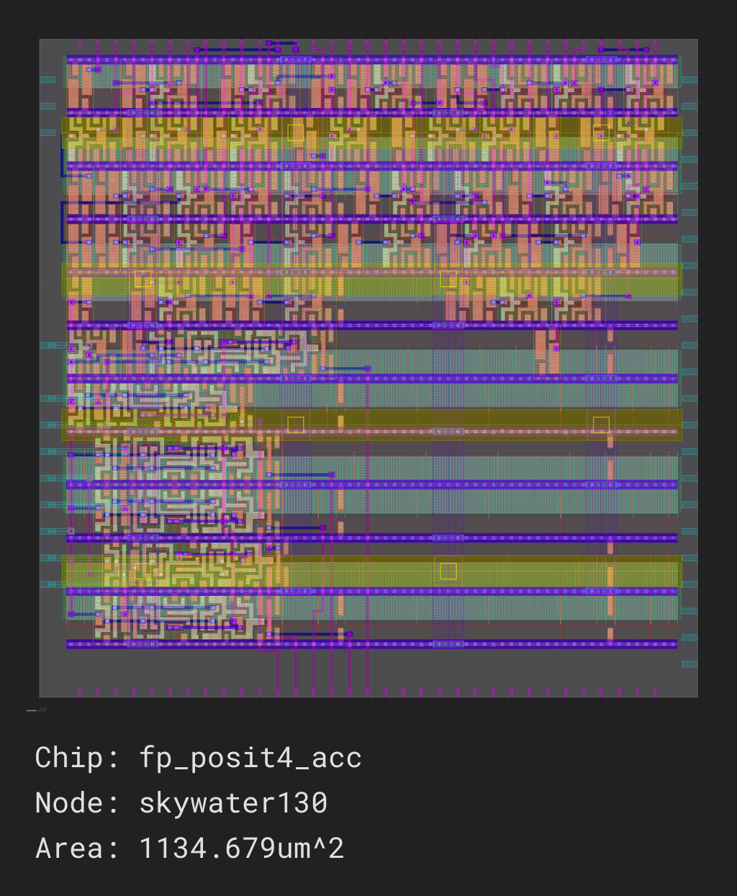
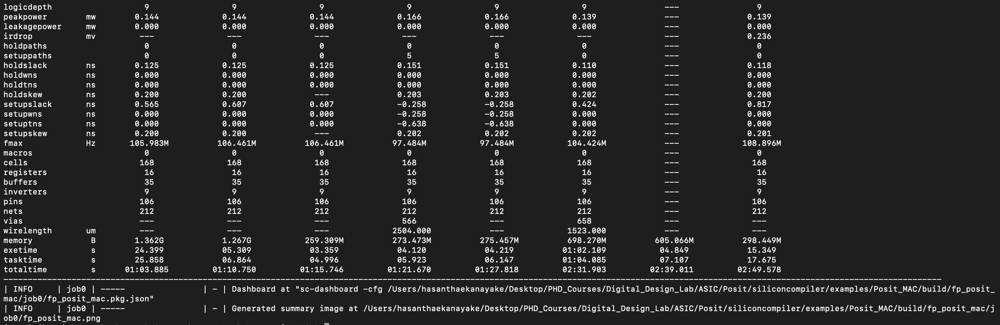
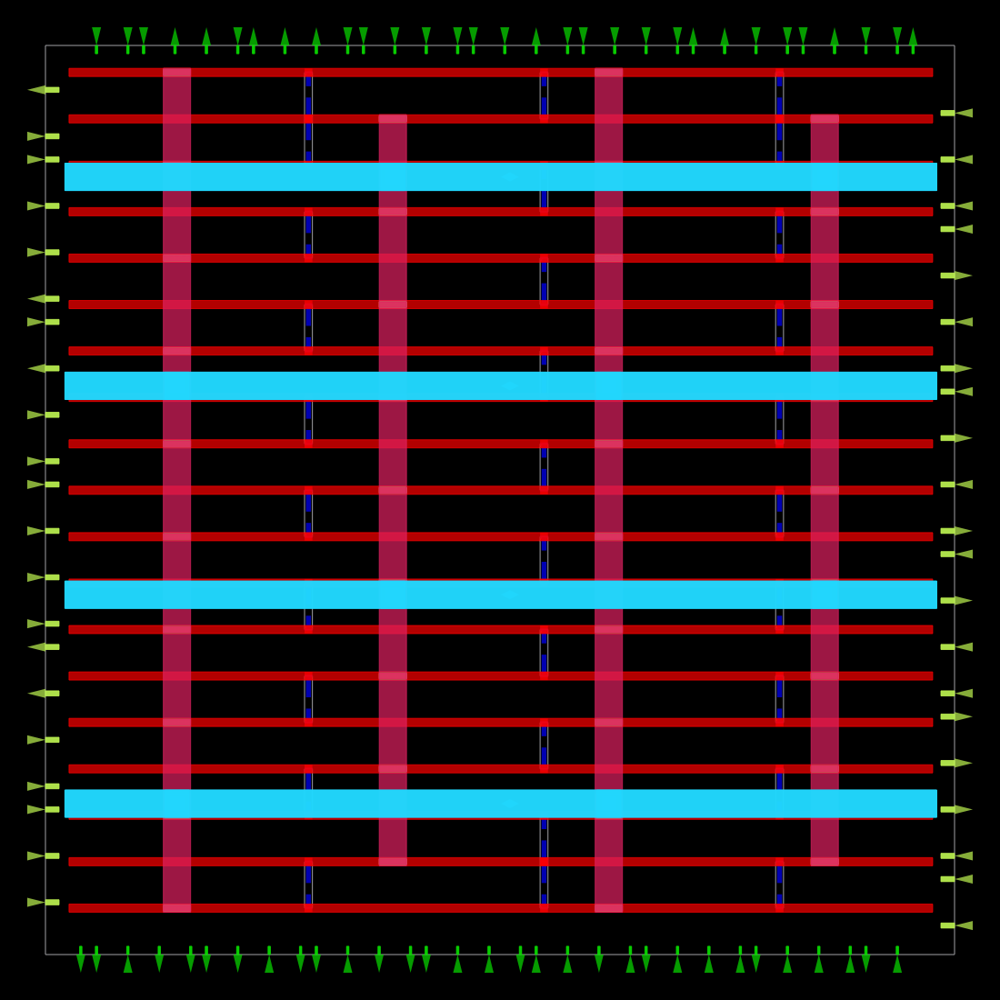
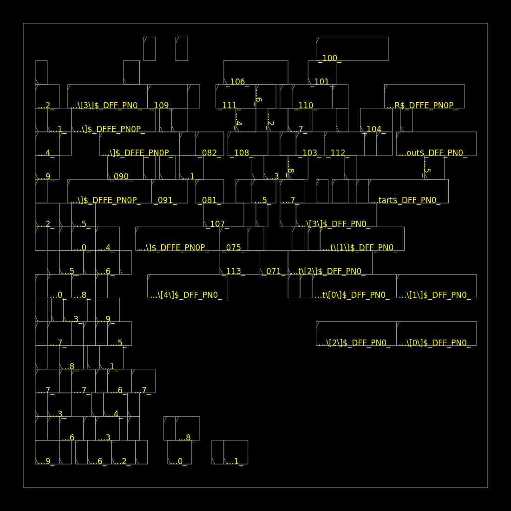
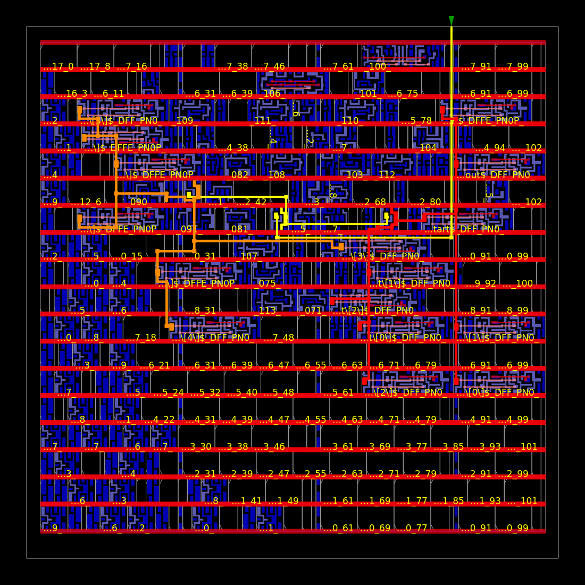
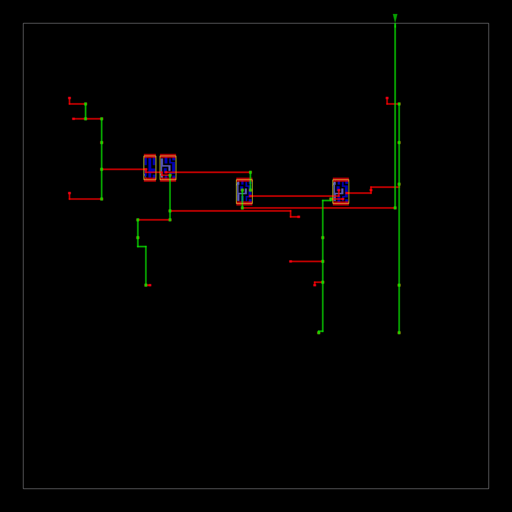
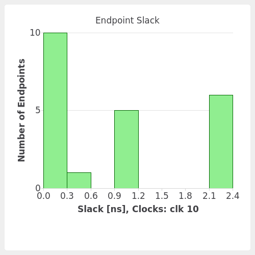
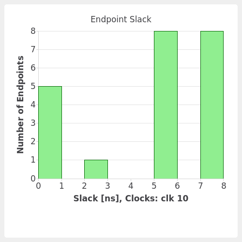
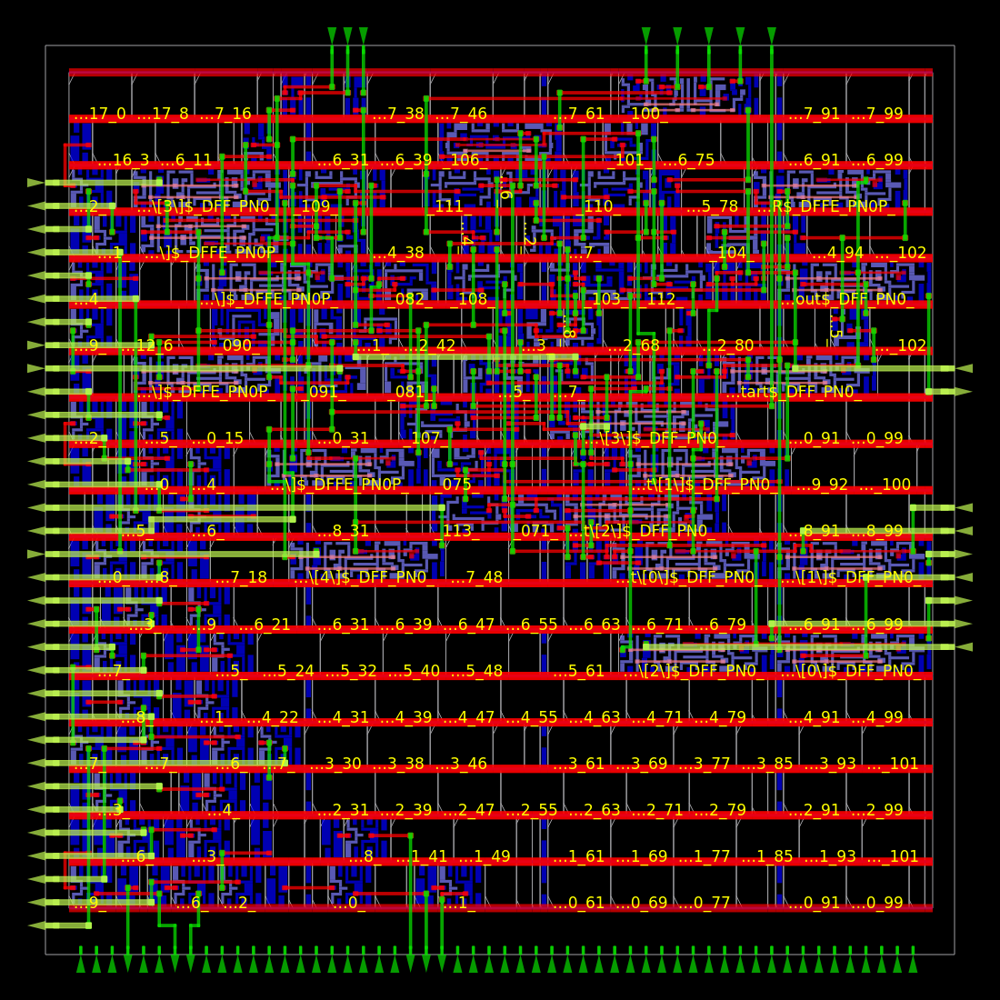
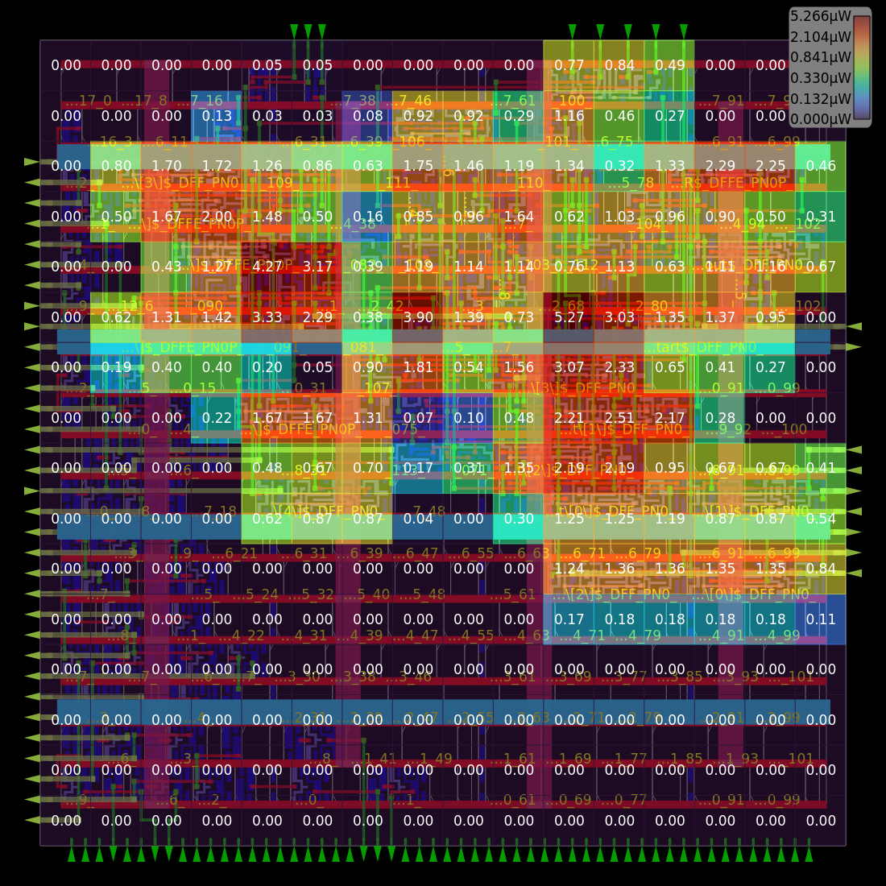

# Posit - Index-based Computation of Real Number Multiplication with SiliconCompiler

## Team Name: 
Posit Silicon Compiler

## Team Members:
- Melika Morsali (qfc2zn)
- Hasantha Ekanayake (uyq6nu)


## 1. Project Overview

#### Project Title: Posit - Index-based Computation of Real Number Multiplication with SiliconCompiler  
#### Repository URL: [GitHub Repository Link](https://github.com/hplp/2025-asic-design-projects-posit_silicon_compiler)

This project is to design and implement a Multiply-Accumulate (MAC) operation where the
activation inputs are in 16-bit IEEE floating-point format (FP16), and the weights are in 4-
bit posit (Posit4) format with SiliconCompiler. SiliconCompiler is an open-source framework
that automates the translation from source code to silicon. We aim to use SiliconCompiler
to compile the Verilog RTL design of FP16-Posit4 MAC to a GDS file.

## 2. Key Objectives:

- Objective 1 - Design a Multiply-Accumulate (MAC) Unit using FP16 activations and Posit4 weights to explore efficiency gains in numerical computing for ML accelerators.

- Objective 2 - Integrate and validate decoding, multiplication, and accumulation stages in Verilog, ensuring functional correctness and numerical accuracy.

- Objective 3 - Leverage SiliconCompiler to automate the synthesis and physical design process, compiling the RTL implementation into a GDS file for fabrication readiness.

## 3. Technology Stack:
 - Hardware Platform: Local workstation or server 
 - Software Tools: SiliconCompiler, Verilog Simulation Tool
 - Languages: Verilog HDL, Python, Shell scripting / Makefiles 

## 4. Expected Outcomes:
1. A fully functional and verified FP16-Posit4 MAC unit, simulated and tested using Verilog testbenches.

2. A hardware-optimized RTL design, synthesized and placed-and-routed using SiliconCompiler with analysis of area, timing, and power.

3. A manufacturable GDS file output, demonstrating the full digital design flow from high-level numerical representation to silicon-level layout.

## 5. Methods

- Implement and test the Posit4 multiplication module in Verilog 
- Implement and test the Posit4 Accumulator module in Verilog 
- Integrate the multiplier and accumulator modules 
- SiliconCompiler Integration and GDS Generation 
- Performance evaluation of MAC 

## 6. Results:

### 6.1 Implementation and test the Posit4 multiplication module in Verilog 
- FP-Posit Multiplication Testbench Result (Implement and test the Posit4 multiplication module):
  <p align="center">
  
</p>

### 6.2 Implementation and test the Posit4 Accumulator module in Verilog 
- FP-Posit Accumulator Testbench Result (Implement and test the Posit4 Accumulator module):
  <p align="center">
  
</p>

### 6.3 Integration of the multiplier and accumulator modules 
- FP-Posit MAC Testbench Result (Integrate the multiplier and accumulator modules):

    <p align="center">
  
</p>


## 7. SiliconCompiler Integration

  


### 7.1 Installation 
https://docs.siliconcompiler.com/en/latest/user_guide/installation.html#installation

- Installing Python
  
  Before installing the SiliconCompiler package, the Python environment needed to be set up. 

- Installing SiliconCompiler

  After the python dependencies have installed, SiliconCompiler needed to be installed.

### 7.2 Archeteture 

#### Standardized Schema​
A single, extensible data model that cleanly separates design descriptions, EDA tools, and Process Design Kits (PDKs), making complex flows configurable yet easy to grasp.​
​
#### Python API & Flowgraph​
An object-oriented Python layer exposes simple set/get access to the schema, a parallel “flowgraph” programming model, and utility functions for setting up runs and collecting metrics.​
​
#### Pluggable Drivers​
Tool- and PDK-specific drivers plug into the core schema at runtime, automatically discovered via a dynamic module search​
​
#### Scalable & Extendable​
The combination of a rich schema, well-defined plugin interfaces, and comprehensive reference docs lets teams rapidly onboard new tools and PDKs without rewriting core code.


### 7.3 ASIC Demo

  Now that SiliconCompiler has installed, the installation can be tested by running a quick demo through the ASIC design flow in the cloud.

```bash
sc -target asic_demo -remote
```
This command generates the design files for the Verilog module Heartbeat. The design flow involves following steps;

1.  Import RTL
2.  Synthesis
3.  Floorplan
•	init
•	tapcell insertion
•	power‐grid routing
•	pin placement
4.  Placement
•	global placement
•	repair (legalization)
•	detailed placement
5.  Clock‐Tree Synthesis (CTS)
•	clock‐tree construction
•	timing‐repair (buffer/inverter insertion)
•	filler‐cell insertion
6.  Routing
•	global routing
•	antenna‐rule repair
•	detailed routing
7.  Final Write‐out
•	GDSII generation
•	view files (DEF/LEF, reports, etc.)


  <p align="center">
  
</p>

### 7.3 FP-Posit Multiplication

Design flow - FP-Posit Multiplication
  <p align="center">
  
</p>

Summary Report - FP-Posit Multiplication

<p align="center">
  
</p>


Chip Layout - FP-Posit Multiplication
  <p align="center">
  
</p>

### 7.4 FP-Posit Accumulator

Design flow - FP-Posit Accumulator
  <p align="center">
  
</p>

Summary Report - FP-Posit Accumulator

<p align="center">
  
</p>


Chip Layout - FP-Posit Accumulator
  <p align="center">
  
</p>

### 7.5 FP-Posit MAC

Design flow - FP-Posit MAC
  <p align="center">
  
</p>

Summary Report - FP-Posit MAC

<p align="center">
  
</p>


Chip Layout - FP-Posit MAC
  <p align="center">
  
</p>

#### 7.6 Performance evaluation of MAC 


Floor Plan
  <p align="center">
  
</p>


Power and Ground Planning
  <p align="center">
  
</p>


Placement
  <p align="center">
  
</p>


Clocks

<div style="display: flex; justify-content: center; align-items: center;">
  
  
</div>

Timing

<div style="display: flex; justify-content: center; align-items: center;">
  
  
</div>


Routing
 <p align="center">
  
</p>


Power Density

 <p align="center">
  
</p>

GDSII generation

  <p align="center">
  
</p>

[▶️ Watch the demo video on OneDrive](https://myuva-my.sharepoint.com/:v:/g/personal/uyq6nu_virginia_edu/EUrEXopo-11LhvKPCUpOJf8BFL82Wty9AOR7l5IHRvMYqQ?e=t8cr6X)


## 8. Key Takeaways

Why SiliconCompiler?

- Ease-of-use: Programmable with a simple Python API
- Portability: Powerful dynamic JSON schema supports ASIC and FPGA design and simulation
- Speed: Flowgraph execution model enables cloud scale execution.
- Friction-less: Remote execution model enables "zero install" compilation
- Modularity: Tool abstraction layer makes it easy to add/port new tools to the project.
- Provenance: Compilation manifests created automatically during execution.
- Documented: An extensive set of auto-generated high quality reference documents.

## 9. Challenges

- Verilog Compatibility
Makeing sure the Verilog codes (including all custom settings) loads into Yosys correctly, so it doesn’t lose any signal sizes or precision.

- Timing Setup
Writing simple timing rules for each stage of the design and create delay files so the timing checker can confirm it meets your clock speed.

- Debugging & Fast Rebuilds
Tracking down errors that only happen in one setup (like wrong file paths or missing settings), and use SiliconCompiler’s cache so only the parts you changed get rebuilt.

## 10.Conclusion

This project focused on designing and implementing a Multiply-Accumulate (MAC) operation using SiliconCompiler. SiliconCompiler, an open-source framework, automates the translation from source code to silicon. Our goal was to utilize SiliconCompiler to compile the Verilog RTL design of the FP16-Posit4 MAC into a GDS file.

In conclusion, SiliconCompiler proves to be a powerful tool for automating the translation from source code to silicon. By leveraging this open-source framework, we successfully compiled the Verilog RTL design of the FP16-Posit4 MAC into a GDS file. This process not only streamlined the design workflow but also demonstrated the efficiency and effectiveness of SiliconCompiler in handling complex digital design tasks. The use of SiliconCompiler significantly enhances productivity and ensures a seamless transition from design to implementation.
## References

[1] [SiliconCompiler](https://www.siliconcompiler.com/)

