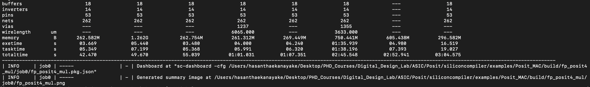

# Posit - Index-based Computation of Real Number Multiplication with SiliconCompiler

## Team Name: 
Posit Silicon Compiler

## Team Members:
- Melika Morsali (qfc2zn)
- Hasantha Ekanayake (uyq6nu)


## 1. Project Overview

#### Project Title: Posit - Index-based Computation of Real Number Multiplication with SiliconCompiler  
#### Repository URL: [GitHub Repository Link](https://github.com/hplp/2025-asic-design-projects-posit_silicon_compiler)

This project is to design and implement a Multiply-Accumulate (MAC) operation where the
activation inputs are in 16-bit IEEE floating-point format (FP16), and the weights are in 4-
bit posit (Posit4) format with SiliconCompiler. SiliconCompiler is an open-source framework
that automates the translation from source code to silicon. We aim to use SiliconCompiler
to compile the Verilog RTL design of FP16-Posit4 MAC to a GDS file.

## 2. Key Objectives:

- Objective 1 - Design a Multiply-Accumulate (MAC) Unit using FP16 activations and Posit4 weights to explore efficiency gains in numerical computing for ML accelerators.

- Objective 2 - Integrate and validate decoding, multiplication, and accumulation stages in Verilog, ensuring functional correctness and numerical accuracy.

- Objective 3 - Leverage SiliconCompiler to automate the synthesis and physical design process, compiling the RTL implementation into a GDS file for fabrication readiness.

## 3. Technology Stack:
 - Hardware Platform: Local workstation or server 
 - Software Tools: SiliconCompiler, Verilog Simulation Tool
 - Languages: Verilog HDL, Python, Shell scripting / Makefiles 

## 4. Expected Outcomes:
1. A fully functional and verified FP16-Posit4 MAC unit, simulated and tested using Verilog testbenches.

2. A hardware-optimized RTL design, synthesized and placed-and-routed using SiliconCompiler with analysis of area, timing, and power.

3. A manufacturable GDS file output, demonstrating the full digital design flow from high-level numerical representation to silicon-level layout.

## 5. Results:

#### 5.1 Implementation and test the Posit4 multiplication module in Verilog 
- FP-Posit Multiplication Testbench Result (Implement and test the Posit4 multiplication module):
  <p align="center">
  
</p>

#### 5.2 Implementation and test the Posit4 Accumulator module in Verilog 
- FP-Posit Accumulator Testbench Result (Implement and test the Posit4 Accumulator module):
  <p align="center">
  
</p>

#### 5.3 Integration of the multiplier and accumulator modules 
- FP-Posit MAC Testbench Result (Integrate the multiplier and accumulator modules):

    <p align="center">
  
</p>

#### 5.4 Integration of the SiliconCompiler and Generation of GDS Files

## SiliconCompiler Integration

### Installation 
https://docs.siliconcompiler.com/en/latest/user_guide/installation.html#installation

- Installing Python
  
  Before installing the SiliconCompiler package, the Python environment needed to be set up. 

- Installing SiliconCompiler

  After the python dependencies have installed, SiliconCompiler needed to be installed.

### ASIC Demo

  Now that SiliconCompiler has installed, the installation can be tested by running a quick demo through the ASIC design flow in the cloud.

```bash
sc -target asic_demo -remote
```
This command generates the design files for the Verilog module Heartbeat.

  <p align="center">
  
</p>

### FP-Posit Multiplication

Design flow - FP-Posit Multiplication
  <p align="center">
  
</p>

Summary Report - FP-Posit Multiplication

  <p align="center">
  
</p>

  <p align="center">
  
</p>


Chip Layout - FP-Posit Multiplication
  <p align="center">
  
</p>

### FP-Posit Accumulator

Design flow - FP-Posit Accumulator
  <p align="center">
  
</p>

Summary Report - FP-Posit Accumulator

  <p align="center">
  
</p>

  <p align="center">
  
</p>


Chip Layout - FP-Posit Accumulator
  <p align="center">
  
</p>

### FP-Posit MAC

Design flow - FP-Posit MAC
  <p align="center">
  
</p>

Summary Report - FP-Posit MAC

  <p align="center">
  
</p>

  <p align="center">
  
</p>


Chip Layout - FP-Posit MAC
  <p align="center">
  
</p>

#### 5.6 Performance evaluation of MAC 

## 6. Key Takeaways

## 7. Challenges
Working on integrating the FP-Posit MAC unit within SiliconCompiler and developing appropriate constraint files for successful synthesis.

## 8.Conclusion

## References
