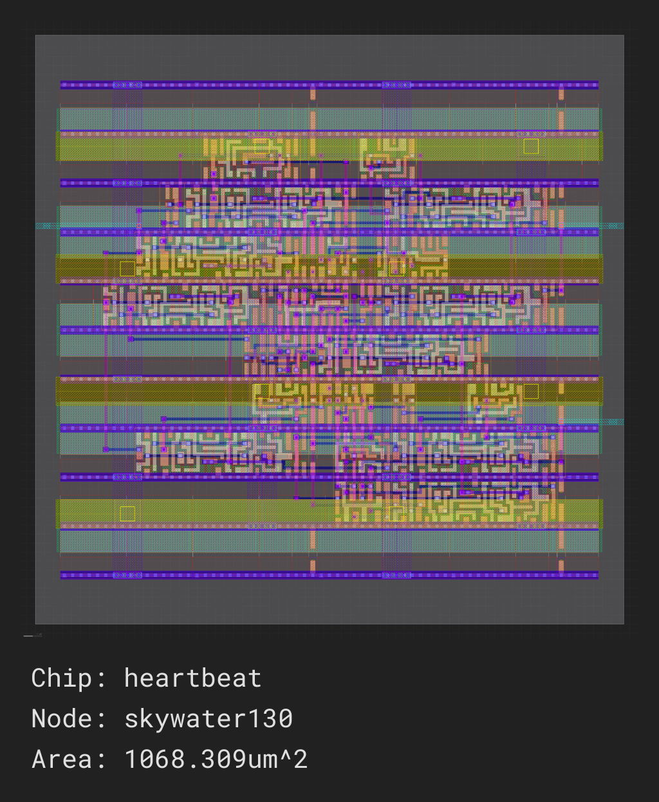

## Implementation and Verification -  FP-Posit MAC

- FP-Posit Multiplication Testbench Result (Implement and test the Posit4 multiplication module):
  <p align="center">
  
</p>


- FP-Posit Accumulator Testbench Result (Implement and test the Posit4 Accumulator module):

  <p align="center">
  
</p>


- FP-Posit MAC Testbench Result (Integrate the multiplier and accumulator modules):

    <p align="center">
  
</p>


## SiliconCompiler Integration and GDS Generation 

### Installation 
https://docs.siliconcompiler.com/en/latest/user_guide/installation.html#installation

- Installing Python
  
  Before installing the SiliconCompiler package you will need to set up a Python environment. 

- Installing SiliconCompiler

  After you’ve got the python dependencies installed, you will need to install SiliconCompiler.

- ASIC Demo

  Now that you have installed SiliconCompiler, you can test your installation by running a quick demo through the ASIC design flow in the cloud.

```bash
sc -target asic_demo -remote
```
This is generating the design files for the verilog code "Heartbeat".

  <p align="center">
  
</p>
