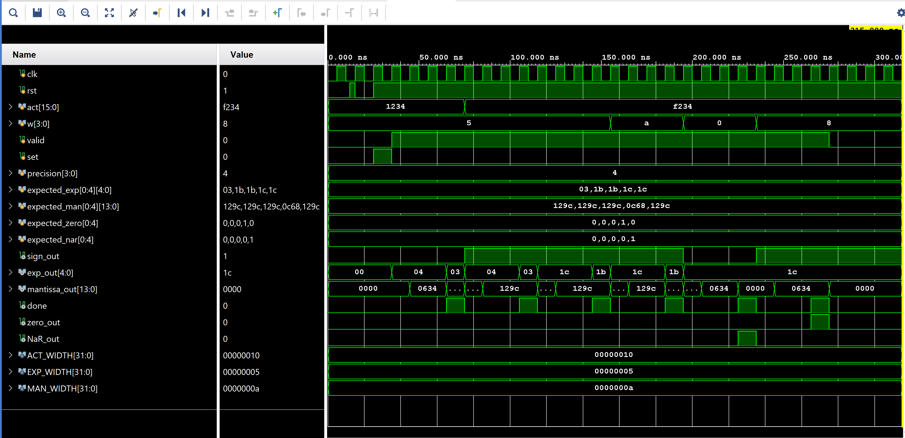
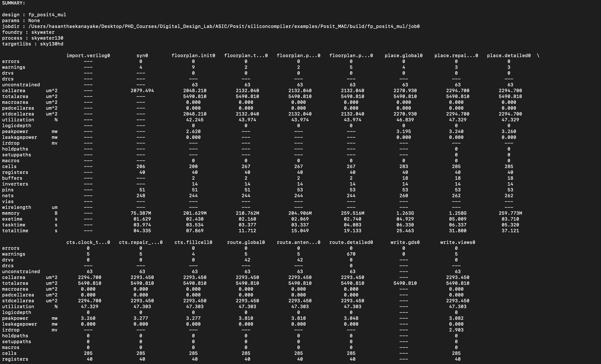
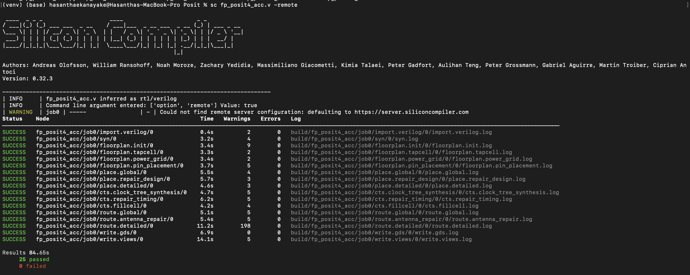
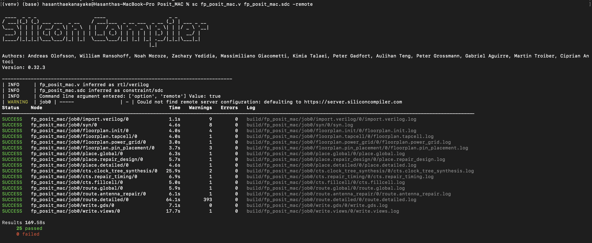
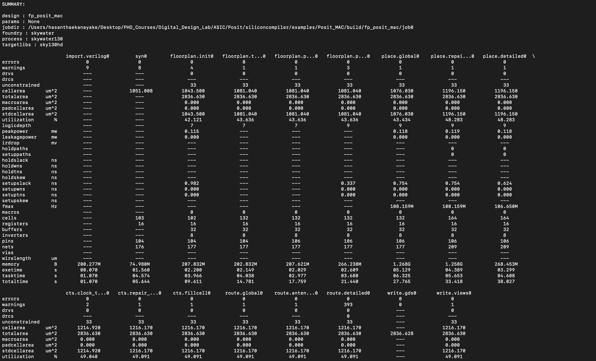

## Implementation and Verification -  FP-Posit MAC

- FP-Posit Multiplication Testbench Result (Implement and test the Posit4 multiplication module):
  <p align="center">
  
</p>


- FP-Posit Accumulator Testbench Result (Implement and test the Posit4 Accumulator module):

  <p align="center">
  
</p>


- FP-Posit MAC Testbench Result (Integrate the multiplier and accumulator modules):

    <p align="center">
  
</p>


## SiliconCompiler Integration

### Installation 
https://docs.siliconcompiler.com/en/latest/user_guide/installation.html#installation

- Installing Python
  
  Before installing the SiliconCompiler package, the Python environment needed to be set up. 

- Installing SiliconCompiler

  After the python dependencies have installed, SiliconCompiler needed to be installed.

### ASIC Demo

  Now that SiliconCompiler has installed, the installation can be tested by running a quick demo through the ASIC design flow in the cloud.

```bash
sc -target asic_demo -remote
```
This command generates the design files for the Verilog module Heartbeat.

  <p align="center">
  
</p>

### FP-Posit Multiplication

Design flow - FP-Posit Multiplication
  <p align="center">
  
</p>

Summary Report - FP-Posit Multiplication

  <p align="center">
  
</p>

  <p align="center">
  
</p>


Chip Layout - FP-Posit Multiplication
  <p align="center">
  
</p>

### FP-Posit Accumulator

Design flow - FP-Posit Accumulator
  <p align="center">
  
</p>

Summary Report - FP-Posit Accumulator

  <p align="center">
  
</p>

  <p align="center">
  
</p>


Chip Layout - FP-Posit Accumulator
  <p align="center">
  
</p>

### FP-Posit MAC

Design flow - FP-Posit MAC
  <p align="center">
  
</p>

Summary Report - FP-Posit MAC

  <p align="center">
  
</p>

  <p align="center">
  
</p>


Chip Layout - FP-Posit MAC
  <p align="center">
  
</p>

## Challenges
Working on integrating the FP-Posit MAC unit within SiliconCompiler and developing appropriate constraint files for successful synthesis.
